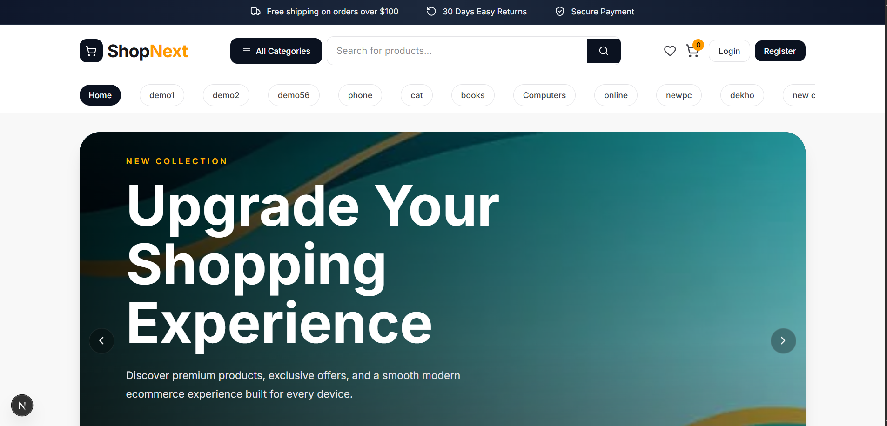
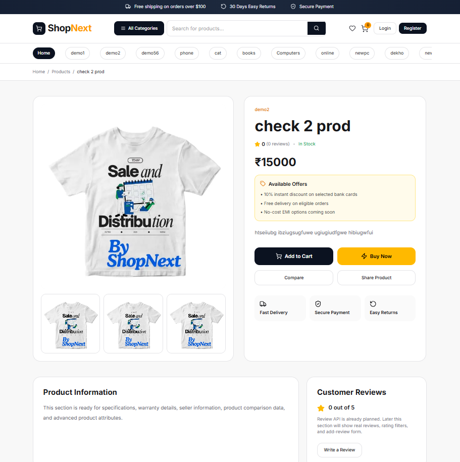
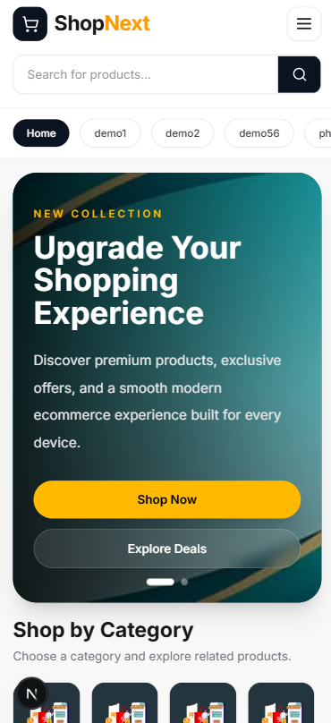

# ShopNext Client

Modern scalable ecommerce frontend built using Next.js 16, TypeScript, Tailwind CSS, and ASP.NET Core Web API backend.

---

# Preview

## Home Page



---

## Product Detail Page



---

## Mobile Responsive UI



---

# Tech Stack

## Frontend

- Next.js 16 (App Router)
- TypeScript
- Tailwind CSS
- Axios
- Zustand
- GSAP
- Framer Motion
- React Query
- Shadcn UI

---

## Backend

Backend API:

```txt
https://shopnext-bz8l.onrender.com/api
```

Swagger:

```txt
https://shopnext-bz8l.onrender.com/swagger
```

Backend built using:

- ASP.NET Core 8 Web API
- Entity Framework Core
- PostgreSQL
- JWT Authentication
- Cloudinary
- Razorpay

---

# Features Implemented

## Home Page

- Responsive Navbar
- Category Navigation
- Hero Banner Slider
- Featured Categories
- Featured Products
- Newsletter
- Footer

---

## Product System

- Product Listing Page
- Product Detail Page
- SEO-friendly Product Slugs
- Responsive Product Cards
- Trending Products Section
- Product Information Section
- Offer Placeholder
- Buy Now Button
- Wishlist Placeholder
- Compare Placeholder

---

## API Integration

Integrated APIs:

```txt
GET /api/banner
GET /api/category
GET /api/product/search
GET /api/product/{id}
```

---

# Folder Structure

```txt
src/
├── app/
├── components/
├── services/
├── lib/
├── store/
├── hooks/
└── types/
```

---

# Current Routes

```txt
/
 /products
 /products/[slug]
```

Example slug:

```txt
/products/premium-headphones-4
```

---

# Environment Variables

Create:

```txt
.env.local
```

Add:

```env
NEXT_PUBLIC_API_URL=https://shopnext-bz8l.onrender.com/api
```

---

# Installation

```bash
git clone https://github.com/imshivendra29/ShopNext-client.git

cd ShopNext-client

npm install

npm run dev
```

---

# Responsive Design

The UI is fully responsive:

- Mobile-first
- Tablet optimized
- Desktop optimized
- Horizontal category scrolling
- Compact mobile product cards

---

# Planned Features

- Authentication
- Cart System
- Checkout Flow
- Address Management
- Razorpay Integration
- Review System
- Product Comparison
- Wishlist
- Skeleton Loading
- Dark Mode
- Product Gallery
- Search Suggestions
- Admin Dashboard

---

# Architecture

Frontend follows scalable architecture:

```txt
Page
 ↓
Service Layer
 ↓
Central API Client
 ↓
Backend API
```

---

# Performance Goals

- SSR rendering
- SEO-friendly URLs
- Optimized image loading
- Component-based architecture
- Future scalable structure

---

# Author

## Shivendra Pratap Singh

GitHub:

```txt
https://github.com/imshivendra29
```

Portfolio:

```txt
https://shivendrasingh.vercel.app
```